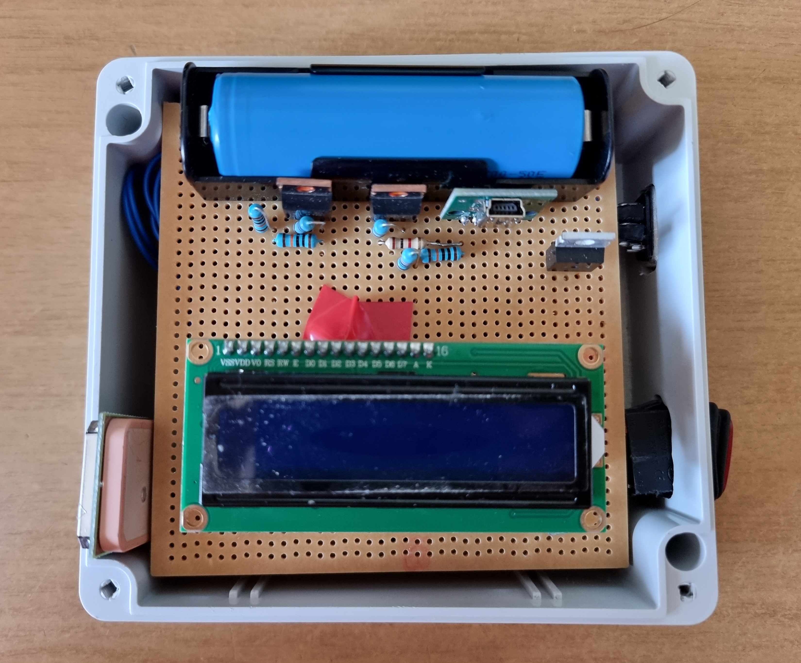
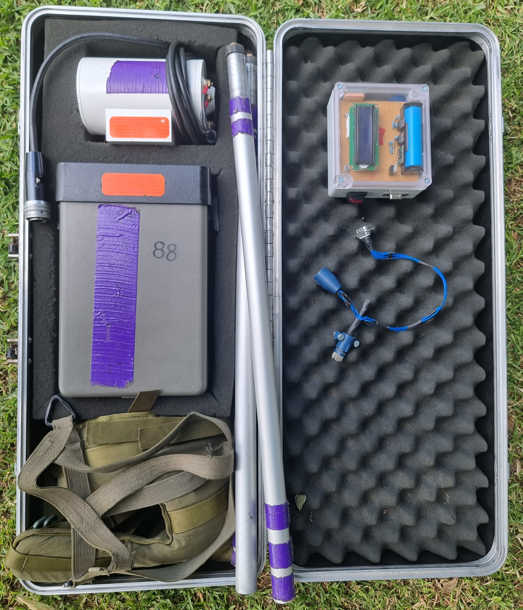
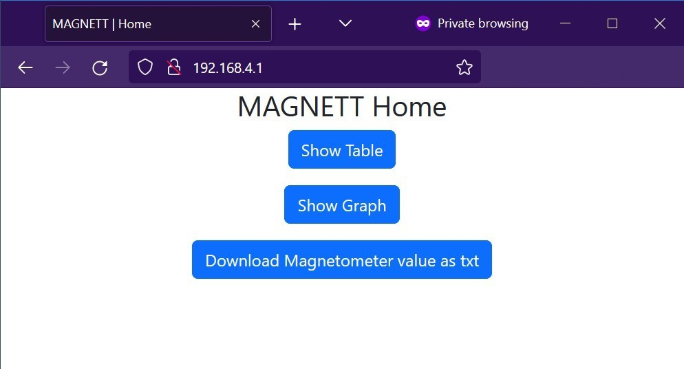
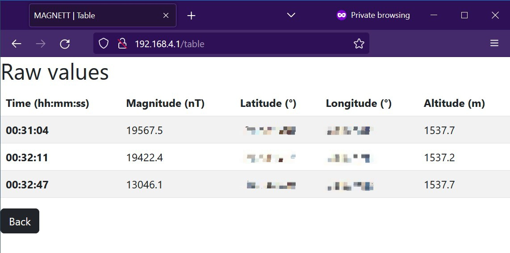
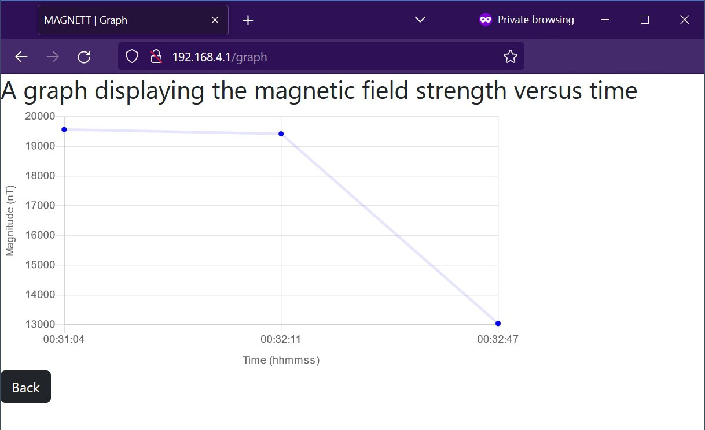
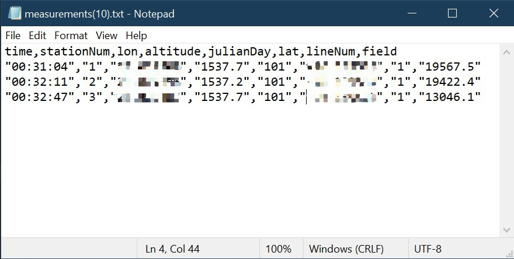

# MAGNETT 🧲
<b>M</b>agnetometer 
<b>A</b>ugmentation 
<b>G</b>adget for 
<b>N</b>etwork 
<b>E</b>nabled 
<b>T</b>elemetry 
<b>T</b>ransmission 
 

MAGNETT is a proof of concept device (or gadget) that allows one to retrieve measurements taken from a G-856AX (manufactured by Geometrics, Inc) over a WiFi connection. It has the ability to save a GPS position for each measurement taken by the G-856AX. It also displays the retrieved data in a table and graph on the web server.  

Our device makes use of an ESP32 and a GPS (amongst other less notable components) to realise the features mentioned above. 

By Huan Lei & Nicholas Warrener 

# Images
## Device

A top view image of our device can be seen below. Our device uses a 5000mAh LiPo battery. 

 

Our device and it's custom connector can be seen inside of the carrying case for a G-856AX. 

 

## Website 

The data in the next three images was taken from a G-856AX. The GPS data corresponding to each magnetic field reading was taken using MAGNETT's built-in NEO-6M GPS. The GPS data has been censored for privacy reasons. 

 

 

 

# Dependencies 
## LCD

Our project uses a generic 1609 LCD with an I2C 'backpack' to reduce the number of wires needed for communication. We used the 
<a href="https://github.com/dhylands/python_lcd">python_LCD</a> library to configure the LCD and display text. Specifically, <code>machine_i2c_lcd.py</code> and <code>lcd_api.py</code> are used from this library.

## GPS

We used the <code>as_GPS.py</code> driver from the <a href="https://github.com/peterhinch/micropython-async">micropython-async</a> library to asynchronously parse the NMEA sentences from the GPS. Just make sure to use V2 and not V3 as the newer version contains functions not supported by the version of micropython-async running on TinyWeb.

## Webserver
[Bootstrap](https://github.com/twbs/bootstrap/tree/v5.2.2/site/content/docs/5.2)- We used the latest release at the time of writing (V5.2.2)  
[Chart.js](https://www.chartjs.org/docs/2.9.4/) - We used an older version (V2.9.4) of this library because we ran into issues running the latest version 
[TinyWeb](https://github.com/belyalov/tinyweb) - The latest release (V1.3.5) is from 2020 which means we had to use an older version of the as_GPS library.

Assembly instructions and circuit designs are coming soon!

# Acknowledgements

We would like to thank Prof K. Nixon for supervising our project and providing us with valuable feedback at the review meetings. We would also like to thank Prof S. Webb of the Geoscience Department for providing us with the necessary hardware as well as giving us valuable feedback and information which helped us contextualize the design. 

